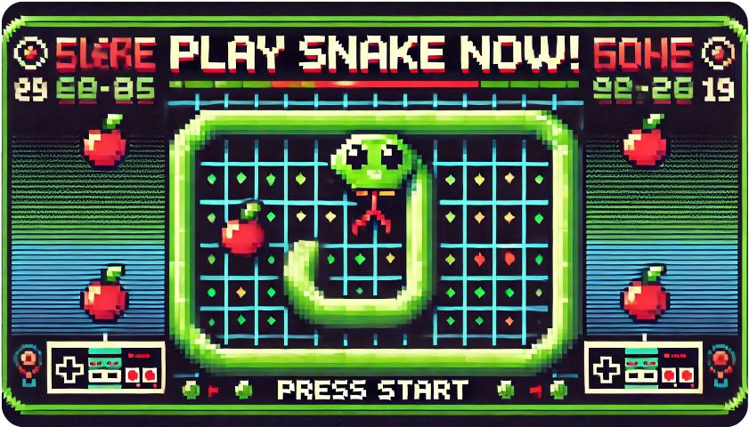

# 🐍 Snake Game 🎮

¡Bienvenido al clásico **Snake Game**! 🐍✨

Este proyecto es una versión en JavaScript del popular juego de Snake, donde controlas una serpiente que debe comer 🍎 para crecer y evitar chocar consigo misma.

## ✨ Características

- 🕹️ **Controles simples**: Usa las flechas del teclado para mover la serpiente en las direcciones deseadas.
- ⏩ **Aumento de dificultad**: La velocidad de la serpiente incrementa a medida que crece.
- 🏆 **Puntuación**: Obtén una puntuación más alta comiendo más elementos sin chocar.

## 💻 Tecnologías utilizadas

Este juego está construido con:

- 🌐 **HTML**: Estructura de la página y el lienzo del juego.
- 🎨 **CSS**: Estilos visuales para el juego y la página.
- 📜 **JavaScript**: Lógica del juego, incluyendo el movimiento de la serpiente y el sistema de colisiones.

## 🎮 Instrucciones para jugar

1. **Descarga** el proyecto y abre el archivo `index.html` en cualquier navegador moderno.
2. Usa las teclas **de flechas** para controlar la dirección de la serpiente.
3. Come los elementos en el tablero para aumentar tu puntuación. 🍏🍎
4. Evita chocar con las paredes o contigo mismo, o el juego terminará. 💥

## 🚀 Cómo iniciar el proyecto

Para probar el juego en tu máquina local:

1. Descarga el repositorio.
2. Navega hasta el archivo `index.html` y ábrelo en un navegador.

## 📂 Estructura del proyecto

- `index.html` - Contiene la estructura HTML del juego.
- `style.css` - Archivo CSS para el estilo visual del juego.
- `script.js` - Lógica y funcionamiento del juego.

## 📸 Captura de pantalla

## 🤝 Contribuciones

Las contribuciones son bienvenidas. Si encuentras un problema o tienes una idea para mejorar el juego, ¡no dudes en crear un issue o enviar un pull request!

---

**¡Diviértete jugando al Snake Game! 🐍💫**
